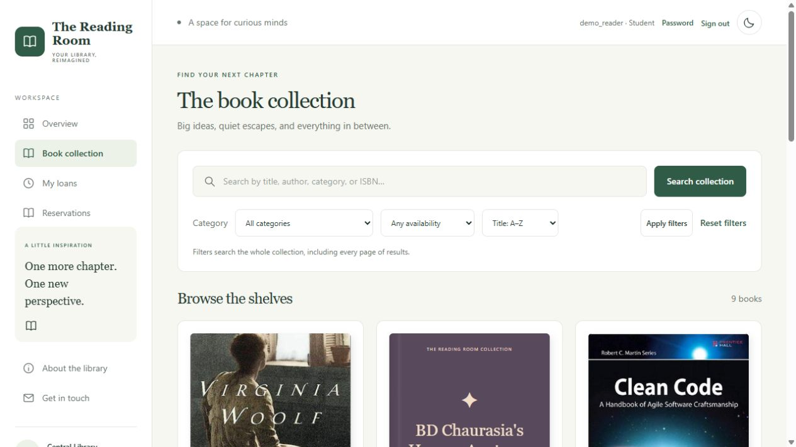
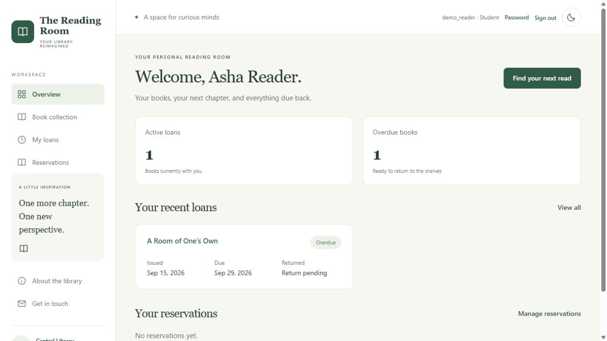

# The Reading Room — Django Library Management

A responsive library application built with **Django 6, MySQL 8 (InnoDB), and
Tailwind CSS**. It covers the full flow from discovering a book to issuing it,
returning it, and allocating it to the next reader in a reservation queue.




## Features

- Librarian/student roles, login, student registration, password change and logout.
- Public book catalogue; private reader directory and personal student history.
- Book and reader create/edit/archive/restore forms with input validation.
- Selected-reader issuing, separate due and actual-return dates, borrowing limits.
- Atomic circulation with MySQL row locks, duplicate-return protection and stock checks.
- FIFO reservations, expiring collection holds, and cancellation/fulfillment history.
- Overdue tracking and a retryable daily email-reminder command with dry-run support.
- Server-side search, filtering, sorting and pagination.
- Mobile-first cards, ISBN cover previews with fallbacks, persistent dark mode.
- Automated permission, workflow, database-constraint and concurrency tests.
- GitHub Actions with a real MySQL service, static asset compilation and deployment checks.

The earlier Render URL in the repository used SQLite. This new MySQL version
must be deployed with database/environment settings from
[the deployment guide](docs/deployment.md); an older live site is not proof that
this branch has been deployed.

## Local setup

Requirements: Python 3.12+, MySQL 8 with InnoDB, and Node 22+ when editing styles.

```powershell
python -m venv .venv
.\.venv\Scripts\python.exe -m pip install -r requirements.txt
Copy-Item .env.example .env
```

Generate a local secret:

```powershell
.\.venv\Scripts\python.exe -c "import secrets; print(secrets.token_urlsafe(48))"
```

Put that value in `DJANGO_SECRET_KEY` in `.env`. Configure your dedicated MySQL
database and user there. Create the database with `CHARACTER SET utf8mb4`; grant
the application user rights on `reading_room.*`. To run tests, that local test
user also needs rights to create/drop `test_reading_room.*`. Never commit `.env`.

```powershell
.\.venv\Scripts\python.exe manage.py migrate
.\.venv\Scripts\python.exe manage.py createsuperuser
.\.venv\Scripts\python.exe manage.py collectstatic --noinput
.\.venv\Scripts\python.exe manage.py runserver 127.0.0.1:8000
```

Open `http://127.0.0.1:8000/`. Superusers are librarians. Other librarian accounts
can be created by an administrator with the **Staff status** flag. Student
registration never grants this flag. Existing reader records are linked to an
account by a librarian; matching a USN or email cannot claim someone else's history.

## Synthetic demo

In local DEBUG mode only:

```powershell
$env:DEMO_PASSWORD='choose-a-local-demo-password-at-least-12-characters'
.\.venv\Scripts\python.exe manage.py seed_demo
```

Log in as `demo_librarian`, `demo_reader`, or `demo_waiter` using that password.
The seed includes an overdue loan and a waiting reservation. It is repeatable and
does not reset existing passwords. Do not expose these accounts on a production
site with real reader records.

The current workstation has an isolated development MySQL instance on **3307**
with data under ignored `.local/mysql-data`. It does not change the existing
MySQL80 service on 3306. Connection credentials are in the ignored `.env`.
See [local instance instructions](docs/local-mysql.md) to restart or stop it.

## Workflow to demonstrate

1. Sign in as a librarian and add/edit a book or reader.
2. Choose a book, select the reader and due date, then confirm the issue.
3. Sign in as that reader to see their loan and overdue status.
4. A second reader reserves an unavailable book.
5. The librarian returns the exact loan; stock increases once and the next
   reservation becomes ready to collect.
6. Issue to the reserved reader; the hold becomes fulfilled.
7. Archive a fully returned book; its historical loans remain available to librarians.

## Tests and styles

```powershell
npm ci
npm run build:css
.\.venv\Scripts\python.exe manage.py collectstatic --noinput
.\.venv\Scripts\python.exe manage.py check
.\.venv\Scripts\python.exe manage.py makemigrations --check --dry-run
.\.venv\Scripts\python.exe manage.py test library --noinput
.\.venv\Scripts\python.exe manage.py send_reminders --dry-run
```

Tailwind source lives in `assets/input.css`; generated CSS is committed under
`library/static/css/style.css`. Keeping build input outside the static directory
lets WhiteNoise safely hash and compress deployable assets. Django templates use
named routes, reusable card components and server-side query parameters.

An explicit `DB_ENGINE=sqlite` development fallback exists, but **MySQL is the
default**, CI uses MySQL, and row-locking tests require MySQL.

## Existing SQLite records

Back up the source first. To move library records into an empty MySQL database:

```powershell
.\.venv\Scripts\python.exe manage.py import_legacy_sqlite --source path\to\backup.sqlite3
```

The source is opened read-only. Import refuses to overwrite populated tables,
reconciles available stock from active loans, and retains borrowing history.
Credentials and sessions are not imported. Migration 0003 also repairs legacy
inventory/date placeholders when upgrading an existing database in place.

## Architecture and deployment

- [Architecture, ER diagram, transactions and design tradeoffs](docs/architecture.md)
- [MySQL deployment, HTTPS, environment variables and email scheduling](docs/deployment.md)
- [Interface notes](UI-README.md)

ISBN covers come from Open Library; failed lookups retain local cover artwork.
No real database, passwords, backups or SMTP credentials are included in new commits.

## Resume description

> Built a Django–MySQL library application with role-based access, transactional
> borrowing, reservation queues, overdue tracking, and a responsive Tailwind UI;
> verified inventory consistency with concurrent-request tests and added MySQL-backed CI.

Add “deployed” and a public demo URL only after deploying this version and verifying
the live workflows. Add the exact passing-test count from your latest test run.
