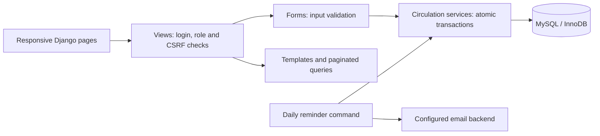
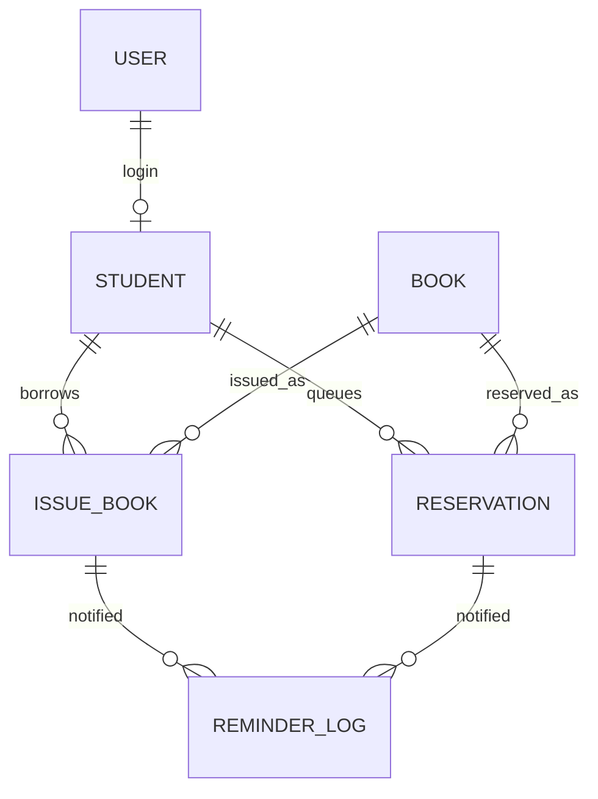

# Design and interview notes

The project uses server-rendered Django templates, Django authentication, MySQL
with InnoDB, and compiled Tailwind CSS. It deliberately avoids a separate SPA and
API layer so the full workflow remains understandable and easy to run.

## Inventory and concurrency

The invariant is `available_copies = quantity - number_of_active_loans`.
Reservations hold available copies without changing the physical stock count.
Every borrowing, return, reservation, and cancellation acquires a lock on the
book row inside `transaction.atomic()`. Requests for the same book are serialized.
Issuing also locks the reader to enforce the per-reader borrowing limit across
different books. Returning identifies a loan, not simply a book, and rejects
an already-returned record before changing stock.

Database checks reject invalid stock and date ranges. The transaction tests use
two independent MySQL connections to race for the last copy and to return the
same loan. SQLite does not implement these row locks, so those tests require MySQL.

## Roles and privacy

An authenticated user with `is_staff=True` is a librarian; student logins have
an optional one-to-one reader profile. Only librarians access the reader directory,
management forms, and issue/return actions. A student cannot choose a different
reader ID to obtain that person's data. Public catalogue pages show books but no
borrower identities. Registration cannot claim an existing USN: an administrator
must create/link an account for an existing reader.

Library circulation is read-only in Django Admin to prevent bypassing inventory
services. Book editing locks the book and recalculates availability. Archival is
blocked by open loans/reservations, preserves history, and can be reversed.

## MySQL reservation uniqueness

MySQL does not support Django's conditional unique constraints. Active
reservations use `active_slot=1`; closed reservations use `NULL`. A unique
constraint on `(book, student, active_slot)` allows many historical records while
preventing duplicate active reservations. A check constraint enforces matching
status and slot values. Ready holds expire after the configured number of days.

## Email delivery

`send_reminders --dry-run` never changes records or sends mail. A normal run
refreshes holds and sends due/overdue messages and ready-to-collect messages.
Successful notifications are recorded so rerunning on the same day skips them.
SMTP failures are retryable. SMTP and database commits cannot be made one atomic
transaction: a crash after SMTP accepts a message but before commit can duplicate
that email. Production systems can address this with an outbox and provider-side
idempotency. This project keeps the simpler command and documents that limitation.

## Legacy data

Migration 0003 derives inventory from existing total quantities and active loans,
sets missing due dates to issue date plus 14 days, and clears the old placeholder
return dates on active loans. Invalid negative prices or impossible historical
return dates require correction rather than silently inventing values.

The SQLite import command reads the source in read-only mode, refuses to overwrite
non-empty target library tables, and imports only books, readers and loan history.
It does not copy old login credentials or sessions. Original records remain in
the local source and backup files, which are excluded from Git.

## Next steps beyond this scope

Public-demo abuse controls such as login/registration rate limiting and email
verification, a task queue with delivery retries, and monitoring are worthwhile
before operating this as a public service with real reader data. Production needs
a configured MySQL host and SMTP provider; neither is provisioned by the code.
